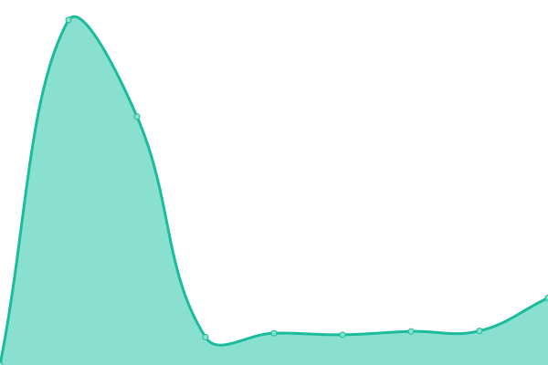

# [📈 Live Status](https://sudoswap.github.io/upptime): <!--live status--> **🟧 Partial outage**

This repository contains the open-source uptime monitor and status page for [sudoswap](https://sudoswap.github.io/upptime), powered by [Upptime](https://github.com/upptime/upptime).

With [Upptime](https://upptime.js.org), you can get your own unlimited and free uptime monitor and status page, powered entirely by a GitHub repository. We use [Issues](https://github.com/sudoswap/upptime/issues) as incident reports, [Actions](https://github.com/sudoswap/upptime/actions) as uptime monitors, and [Pages](https://sudoswap.github.io/upptime) for the status page.

<!--start: status pages-->
<!-- This summary is generated by Upptime (https://github.com/upptime/upptime) -->
<!-- Do not edit this manually, your changes will be overwritten -->
<!-- prettier-ignore -->
| URL | Status | History | Response Time | Uptime |
| --- | ------ | ------- | ------------- | ------ |
|  [Sudo Website](https://sudoswap.xyz) | 🟩 Up | [sudo-website.yml](https://github.com/sudoswap/upptime/commits/HEAD/history/sudo-website.yml) | 

 195ms
     
 | 

<a href="https://status.sudoswap.xyz/history/sudo-website">100.00%</a>
    

|  [Sudo Website V1](https://v1.sudoswap.xyz) | 🟩 Up | [sudo-website-v1.yml](https://github.com/sudoswap/upptime/commits/HEAD/history/sudo-website-v1.yml) | 

 209ms
     
 | 

<a href="https://status.sudoswap.xyz/history/sudo-website-v1">100.00%</a>
    

|  [Edge API](https://edge.sudoapi.xyz/api/health) | 🟩 Up | [edge-api.yml](https://github.com/sudoswap/upptime/commits/HEAD/history/edge-api.yml) | 

 470ms
     
 | 

<a href="https://status.sudoswap.xyz/history/edge-api">100.00%</a>
    

|  [Sudo API V2](https://v2.sudoapi.xyz/app/status) | 🟥 Down | [sudo-api-v2.yml](https://github.com/sudoswap/upptime/commits/HEAD/history/sudo-api-v2.yml) | 

 281ms
     
 | 

<a href="https://status.sudoswap.xyz/history/sudo-api-v2">0.00%</a>
    

|  [Sudo API (/health)](https://sudoapi.xyz/v1/health) | 🟥 Down | [sudo-api-health.yml](https://github.com/sudoswap/upptime/commits/HEAD/history/sudo-api-health.yml) | 

 208ms
     
 | 

<a href="https://status.sudoswap.xyz/history/sudo-api-health">0.00%</a>
    

|  [Mainnet Indexer (test query)](https://ecstatic-armor-380509.uw.r.appspot.com/status) | 🟥 Down | [mainnet-indexer-test-query.yml](https://github.com/sudoswap/upptime/commits/HEAD/history/mainnet-indexer-test-query.yml) | 

 145ms
     
 | 

<a href="https://status.sudoswap.xyz/history/mainnet-indexer-test-query">0.00%</a>
    

|  Mainnet Ethereum Node (rpc) | 🟩 Up | [mainnet-ethereum-node-rpc.yml](https://github.com/sudoswap/upptime/commits/HEAD/history/mainnet-ethereum-node-rpc.yml) | 

 178ms
     
 | 

<a href="https://status.sudoswap.xyz/history/mainnet-ethereum-node-rpc">100.00%</a>
    

|  [Defined.fi](https://graph.codex.io/graphql) | 🟩 Up | [defined-fi.yml](https://github.com/sudoswap/upptime/commits/HEAD/history/defined-fi.yml) | 

 310ms
     
 | 

<a href="https://status.sudoswap.xyz/history/defined-fi">100.00%</a>
    

<!--end: status pages-->

[**Visit our status website →**](https://sudoswap.github.io/upptime)

## 📄 License

- Powered by: [Upptime](https://github.com/upptime/upptime)
- Code: [MIT](./LICENSE) © [sudoswap](https://sudoswap.github.io/upptime)
- Data in the `./history` directory: [Open Database License](https://opendatacommons.org/licenses/odbl/1-0/)
